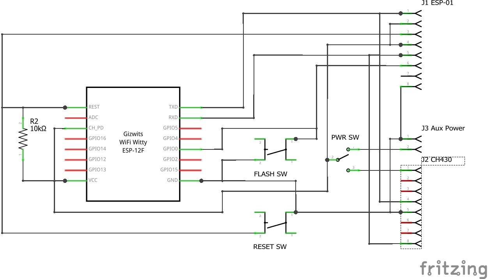
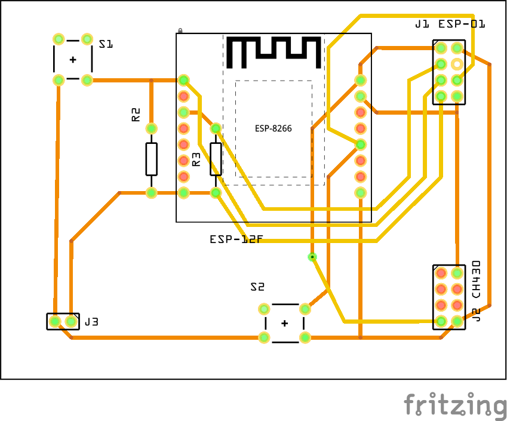

# ESP8266 Programmer

Simple device to program bare ESP8266 (i.e. ESP-12F) or ESP-01 modules.

The programmer has following capabilities:
* external power supply connector for stable operation during flashing,
* handles ESP-01 modules (2x4 DIL) or 2x8 modules (ESP-07, ESP-12 - via 2x8 pin breakout board) - but only one kind of modules at a time,
* reset switch (S1),
* flash-Mode switch (S2)  - allows for flashing or regular usage.

It requires typical ESP-01 programmer to be plugged into J2.

## Schematics

## PCB

The programmer fits into typical 8x6cm double sided universal board.

