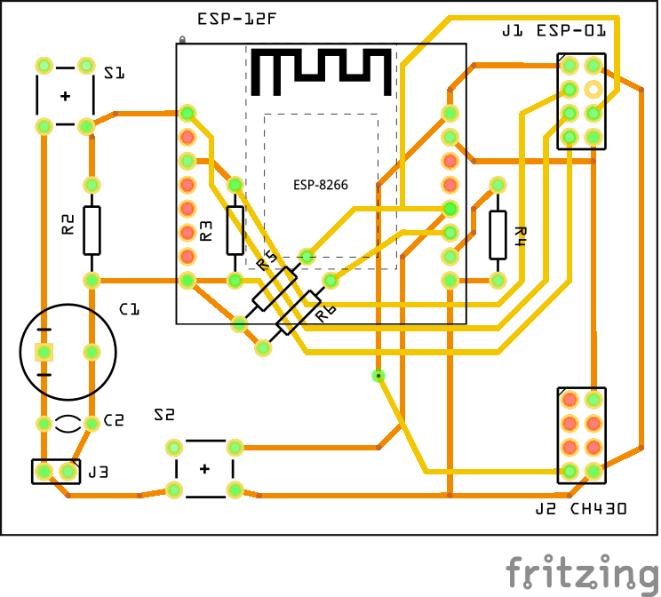

# ESP8266 Programmer

Simple device to program bare ESP8266 (i.e. ESP-12F) or ESP-01 modules.

## Features
The programmer has following capabilities:
* external power supply connector and filters for stable operation during flashing,
* handles ESP-01 modules (2x4 DIL) or 2x8 modules (ESP-07, ESP-12 - via 2x8 pin breakout board) - but only one kind of modules at a time,
* reset switch (S1),
* flash mode switch (S2)  - allows for flashing or regular usage.

It requires typical ESP-01 programmer to be plugged into J2.

## Project structure
* `src\fritzing` - Fritzing data file (schematics and PCB design),

## Schematics
The schematics of the device has been split into several sections for clarity. See below for detailed description of the sections.

## Hardware assembly
### Bill of materials
| #   | Code | Name        | Description                | Price (PLN) |
|----:|:----:|-------------|----------------------------|------------:|
|1    |R1    | Resistor    | 10k                        |0.02|
|2    |R2    | Resistor    | 10k                        |0.02|
|3    |R3    | Resistor    | 10k                        |0.02|
|4    |R4    | Resistor    | 10k                        |0.02|
|5    |R5    | Resistor    | 10k                        |0.02|
|6    |C1    | Capacitor   | 1000uF, Electrolytic       |0.50|
|7    |C2    | Capacitor   | 100nF, Ceramic             |1.39|
|8    |S1    | Tact switch |                            |0.23|
|9    |S2    | Tact switch |                            |0.23|
|10   |J1    | Socket      | 2x4, 2.54mm, female        ||
|11   |J2    | Goldpin     | 2x4, 2.54mm, male          ||
|12   |J3    | Goldpin     | 1x2, 2.54mm, male          ||
|13   |      | PCB         | Universal board, 8x6cm     ||
|     |      |             |                   **Total**|****|

### The PCB design
The programmer fits into typical 8x6cm double sided universal board.

## Usage
### Flashing
1. Plug ESP-01 programming device into J2,
2. either plug ESP-01 module into J1 socket or ESP-07/12 into ESP8266 socket (do not plug both at once!),
3. connect ESP-01 programming device with PC via USB cable,
4. press S2 button,
5. while S2 button is pressed, connect 3.3V power source to the J3.

The module should be in flashing mode already, now use flashing software from PC to upload a firmware of choice.

### Regular usage
1. Either plug ESP-01 module into J1 socket or ESP-07/12 into ESP8266 socket (do not plug both at once!),
2. connect 3.3V power source to the J3.

The module will boot and run normally.

At any time it is possible to turn device into flashing mode by pressing Reset (S1) while Flash button (S2) is pressed.
