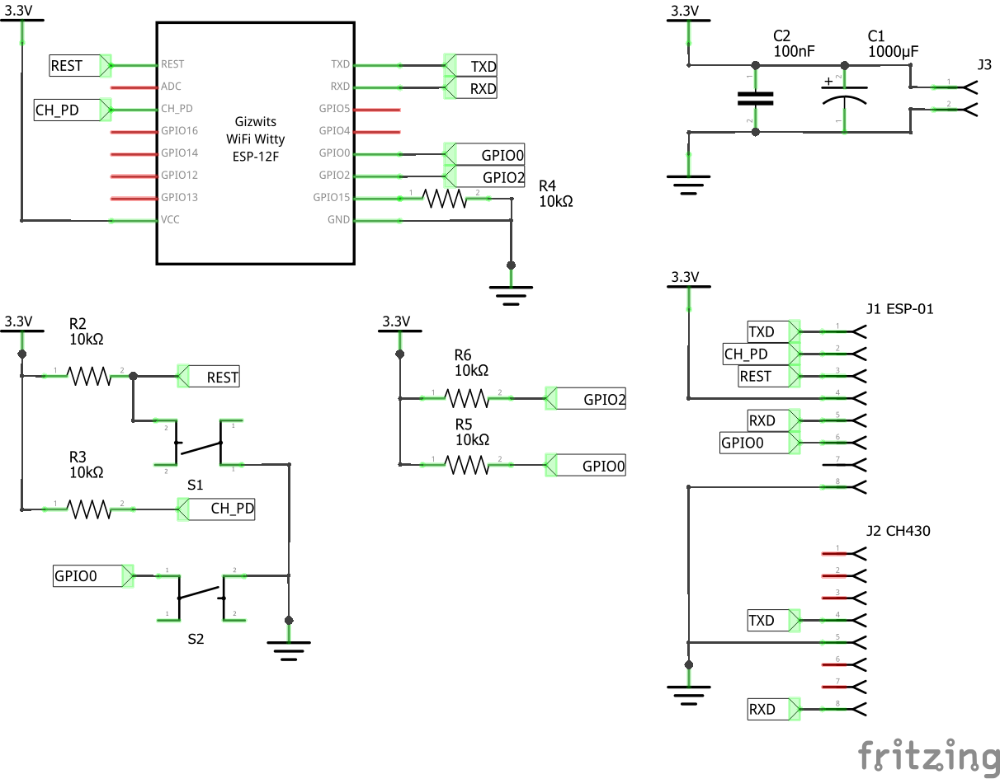

# ESP8266 Programmer

Simple device to program bare ESP8266 (i.e. ESP-12F) or ESP-01 modules.

The programmer has following capabilities:
* Can be powered either from external source (J3) or from USB programmer (J2) - selectable by PWR SW.
* Handles ESP-01 modules (2x4 DIL) or 2x8 modules (ESP-07, ESP-12 - via appropriate adapter) - only one kind of modules at a time.
* Reset switch (RESET SW).
* Flash-Mode switch (FLASH SW)  - allows for flashing or regular usage.

It requires typical ESP-01 programmer to be plugged into J2.

## Schematics

## PCB

The programmer fits into typical 8x6cm double sided universal board.

